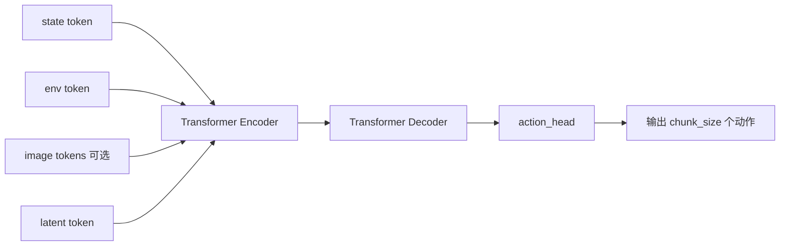
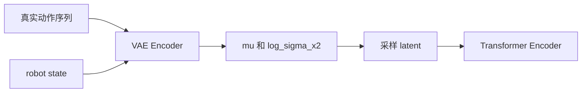

# ACT 调用链

本文档说明 AKA-Sim 仓库中 ACT 的目录位置、基本概念、工作原理，以及当前项目里的实际调用链。

## 1. ACT 是什么

ACT 全称是 Action Chunking Transformer。

它的核心思想不是每次只预测一个动作，而是一次性预测未来一小段动作序列，也就是一个 action chunk。这样做有两个直接好处：

- 能学习到短时间范围内更稳定的动作模式
- 能减少逐步决策时的抖动和局部贪心问题

在本项目里，ACT 用来根据小车当前观测信息预测后续动作。当前 React 模拟器里，动作最终会被映射成离散控制指令：

- `up`
- `down`
- `left`
- `right`
- `stop`

## 2. 仓库中 ACT 相关目录

### 核心算法目录

- `backend/policies/act/`
  - `configuration_act.py`
  - `modeling_act.py`

### 训练与推理入口

- `backend/train.py`
- `backend/app/routes/api.py`
- `backend/app/routes/websocket.py`

### 前端调用入口

- `frontend/src/pages/SimPage.tsx`
- `frontend/src/api/socket.ts`

### 补充示例/旧版页面

- `main.html`

## 3. ACT 在本项目中的工作原理

### 3.1 输入是什么

当前主流程里，模型主要使用两类结构化输入：

- `observation.state`
- `observation.environment_state`

在 React 模拟器中，这两组观测由 `SimPage.tsx` 动态生成：

- `state` 长度为 14
- `envState` 长度为 7

其中包含小车位置、朝向、速度、目标距离、碰撞状态、前向可通行距离等信息。

同时，数据采集阶段也会保存动作标签：

- `action`
- `action_is_pad`

当前 React 页面使用的动作向量是 5 维 one-hot 风格：

- `[1,0,0,0,0] -> up`
- `[0,1,0,0,0] -> down`
- `[0,0,1,0,0] -> left`
- `[0,0,0,1,0] -> right`
- `[0,0,0,0,1] -> stop`

补充说明：

- 前端数据采集阶段会额外保存第一人称图像
- `ACT` 模型本身也支持图像特征输入
- 当前主训练链路已经支持把图像一起接入 `build_config()` 和 `ACT.forward()`

所以当前实现已经变成：

- 图像会被采集和存盘
- 数据加载阶段会把观测图像解码为张量
- 训练和在线推理都可以把图像作为模型输入使用

### 3.2 为什么叫 Action Chunking

前端采集到的连续轨迹不会直接按“单步样本”保存，而是会切成定长 chunk。

当前 React 页面里：

- `CHUNK_SIZE = 10`

也就是说，训练样本的目标不是“下一步动作”，而是“未来 10 步动作序列”。

如果某个回合末尾不足 10 步，会用 0 补齐，并通过 `action_is_pad` 标记哪些位置是填充位。

### 3.3 模型内部大致怎么工作

`backend/policies/act/modeling_act.py` 中的 `ACT` 模型可以概括为下面这条主线：

1. 把状态、环境状态，以及可选图像特征编码成 token
2. 训练时如果开启 `use_vae`，还会额外用 `vae_encoder` 对动作序列做潜变量建模
3. 把 latent token、state token、env token、image token 一起送入 Transformer Encoder
4. Decoder 使用固定数量的 query token，对应整个动作 chunk 的每一个时间位
5. 通过 `action_head` 输出形状为 `(B, chunk_size, action_dim)` 的动作序列

可以把它理解成：

- Encoder 负责“读懂当前观测条件”
- Decoder 负责“生成未来一段动作计划”

### 3.4 训练目标是什么

当前 `backend/train.py` 中的训练目标是行为克隆：

- 预测动作 `actions_pred`
- 对齐真实动作 `actions_gt`
- 使用 `MSE loss`

如果启用 VAE，还会额外叠加 KL loss。

### 3.5 在线推理时怎么落地成控制指令

在线推理时，模型虽然会输出整段动作 chunk，但当前 API 实现只取：

- `actions[0, 0]`

也就是 batch 中第一个样本、chunk 中第一个动作。

然后后端把这个动作向量映射成控制指令：

- `up`
- `down`
- `left`
- `right`
- `stop`

最后把这个离散动作真正作用到小车物理状态上。

这意味着当前项目的在线控制方式是：

- 模型一次预测一段动作
- 系统实际每次只执行这段里的第一个动作
- 下一帧再次根据最新观测重新推理

## 4. 主调用链：React 页面 -> 数据集 -> 训练 -> 推理

这是当前项目最主要、最完整的一条 ACT 使用链路。

```mermaid
flowchart TD
    A[用户在 SimPage 手动驾驶小车] --> B[前端记录 state envState action image]
    B --> C[packDataset 按 CHUNK_SIZE 切块并补 pad]
    C --> D[saveDataset 调用 POST /api/dataset]
    D --> E[后端保存 output/datasets/act_dataset_xxx.pt]

    E --> F[前端调用 POST /api/train/start]
    F --> G[backend/app/routes/api.py 启动训练线程]
    G --> H[backend/train.py: train_from_dataset]
    H --> I[load_dataset_from_local]
    I --> J[build_config]
    J --> K[ACT(config)]
    K --> L[train_act]
    L --> M[保存 output/train/act_xxx/act_checkpoint.pt]

    M --> N[前端选择模型并开启 ACT]
    N --> O[POST /api/infer/start]
    O --> P[后端加载 checkpoint 到 infer_state.model]
    P --> Q[渲染循环中定时 POST /api/infer/step]
    Q --> R[ACT.forward 输入 state/env_state]
    R --> S[输出 actions]
    S --> T[取 actions[0,0]]
    T --> U[_map_action 映射为 up/down/left/right/stop]
    U --> V[_apply_action 更新小车状态]
    V --> W[前端继续渲染下一帧]
```

## 5. 分阶段看 ACT 调用链

### 5.1 数据采集链

主文件：

- `frontend/src/pages/SimPage.tsx`
- `frontend/src/api/socket.ts`
- `backend/app/routes/api.py`

链路：

1. 用户在 `SimPage` 中手动控制小车
2. 页面每帧根据小车与地图生成 `state`、`envState`
3. 同时把用户当前指令转换成 5 维动作向量
4. `packDataset()` 把轨迹切成 chunk，并生成 `action_is_pad`
5. `saveDataset()` 调用 `POST /api/dataset`
6. 后端把张量保存为 `.pt` 数据集文件

这里的关键点是：

- 数据集不是逐步样本，而是 chunk 样本
- 训练维度不是写死在后端，而是训练时从数据集自动读取

### 5.2 训练链

主文件：

- `backend/app/routes/api.py`
- `backend/train.py`
- `backend/policies/act/configuration_act.py`
- `backend/policies/act/modeling_act.py`

链路：

1. 前端点击“开始训练”
2. `POST /api/train/start`
3. 后端启动 `_run_training()`
4. 调用 `train_from_dataset()`
5. 读取数据集，自动推断：
   - `state_dim`
   - `env_state_dim`
   - `action_dim`
   - `chunk_size`
6. 调用 `build_config()`
7. 构建 `ACT(config)`
8. 用 `train_act()` 执行 epoch 循环
9. 保存：
   - `act_checkpoint.pt`
   - `training_metrics.json`

当前 checkpoint 除了模型参数，还会补充写入：

- `state_dim`
- `env_state_dim`
- `action_dim`
- `chunk_size`
- `use_vae`

这样推理时就可以按训练时的真实维度恢复模型。

这里还有一个很关键的实现细节：

- 数据集文件里如果包含图像路径，训练加载阶段会读取每个 chunk 的首帧观测图像
- `train_from_dataset() -> build_config()` 会把视觉特征注册到 `input_features`
- 因此当前主训练链路已经支持“图像 + state + environment_state”的 ACT

### 5.3 在线推理链

主文件：

- `frontend/src/pages/SimPage.tsx`
- `backend/app/routes/api.py`

链路：

1. 前端选择某个训练好的模型
2. 打开 ACT 开关
3. 前端调用 `POST /api/infer/start`
4. 后端读取 checkpoint，重建 `ACT(config)`，放入 `infer_state`
5. 前端渲染循环按固定频率调用 `POST /api/infer/step`
6. 前端可同时上传当前第一人称图像
7. 后端把 `state`、`env_state`、`images` 打成 tensor
8. 调用 `model({OBS_STATE, OBS_ENV_STATE, OBS_IMAGES})`
9. 模型返回整段动作 `actions`
10. 当前实现只取 `actions[0, 0]`
11. `_map_action()` 把动作向量转换为离散控制指令
12. `_apply_action()` 更新小车状态并广播状态
13. 前端根据更新后的状态继续渲染

## 6. 模型内部调用链

如果只看 `ACT.forward()`，可以概括成下面这张图：



如果启用 VAE，`latent token` 的来源是：



训练时：

- latent 来自动作序列的编码结果

推理时：

- 当前实现不走动作条件编码
- latent 使用零向量
- 如果 checkpoint 记录了视觉配置，推理也会同时接收图像输入

所以可以把当前推理过程理解为：

- “仅根据当前观测条件，直接生成未来动作 chunk”

## 7. 当前项目里有两条补充链路

### 7.1 WebSocket 推理链

文件：

- `backend/app/routes/websocket.py`
- `frontend/src/api/socket.ts`

说明：

- 后端提供了 `act_infer` WebSocket 事件
- 前端也保留了 `actInfer()` 方法
- 但当前 `SimPage.tsx` 的主推理流程实际上走的是 HTTP 接口：
  - `/api/infer/start`
  - `/api/infer/step`
  - `/api/infer/stop`

也就是说，WebSocket 版本仍是备用/兼容入口，但也已经支持带图像的视觉推理。

### 7.2 旧版 `main.html` 演示链

文件：

- `main.html`

说明：

- 根目录 `main.html` 仍然保留了一套 ACT 相关交互和演示逻辑
- 包含数据整理、训练、推理与可视化
- 但当前工程化主页面已经迁移到 React 的 `SimPage.tsx`

因此阅读源码时建议优先看：

- React 主链路
- Flask API 主链路

再把 `main.html` 当作补充参考。

## 8. 关键文件速查

| 作用 | 文件 |
|---|---|
| ACT 配置 | `backend/policies/act/configuration_act.py` |
| ACT 模型 | `backend/policies/act/modeling_act.py` |
| 数据集与训练主逻辑 | `backend/train.py` |
| 数据集/训练/推理 API | `backend/app/routes/api.py` |
| WebSocket 推理入口 | `backend/app/routes/websocket.py` |
| React 主页面 | `frontend/src/pages/SimPage.tsx` |
| 前端 Socket 封装 | `frontend/src/api/socket.ts` |
| 旧版单页演示 | `main.html` |

## 9. 一句话总结

当前项目里的 ACT 主链路可以概括为：

手动驾驶采集轨迹 -> 前端按 chunk 打包数据集 -> 后端训练 ACT -> 保存 checkpoint -> 前端加载模型 -> 后端按当前观测推理动作 chunk -> 取第一个动作驱动小车。

如果只想快速读代码，推荐顺序是：

1. `frontend/src/pages/SimPage.tsx`
2. `backend/app/routes/api.py`
3. `backend/train.py`
4. `backend/policies/act/modeling_act.py`
